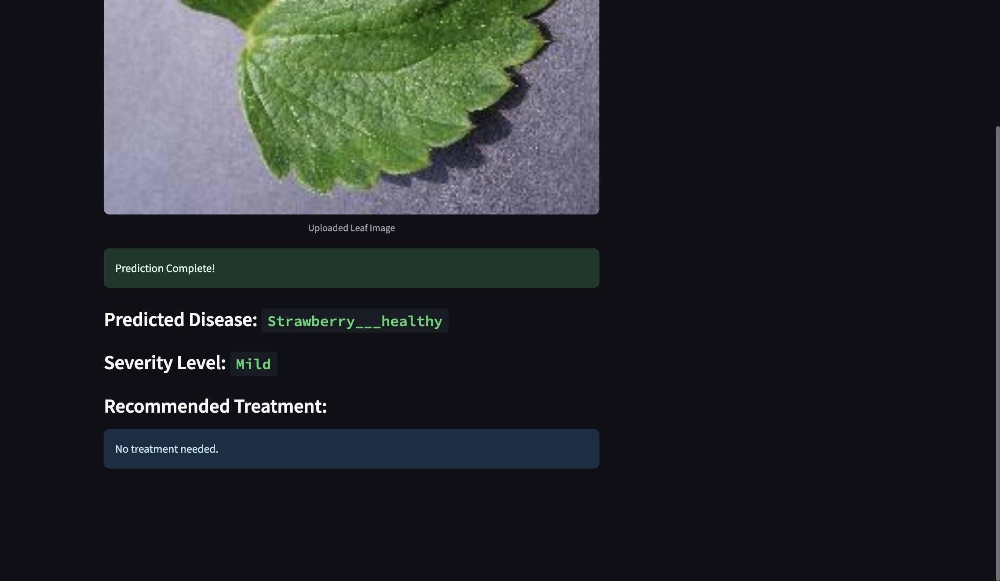

## Overview

The goal of this project was to build an end-to-end plant disease detection system that goes beyond basic image classification.

The system takes a plant leaf image as input and predicts:

- the plant disease
- the severity level of the infection
- a treatment recommendation based on the prediction

I compared multiple transfer learning models and used a Streamlit interface to make the final model easy to test with uploaded leaf images.

## Demo

Here is a sample prediction from the Streamlit app:



The model identified the uploaded leaf as `Strawberry___healthy`, predicted the severity as `Mild`, and returned `No treatment needed.`

## How It Works

1. A leaf image is uploaded through the Streamlit app.
2. The image is resized and normalized before prediction.
3. The trained CNN predicts both the disease class and severity level.
4. The predicted disease and severity are matched with the treatment data.
5. The application displays the disease, severity, and recommended treatment.

## Models

I experimented with three pretrained CNN architectures:

- MobileNetV2
- ResNet50
- ResNet101

Each model was fine-tuned for plant disease classification and severity prediction.

### Model Comparison

| Model | Disease Accuracy | Severity Accuracy |
|---|---:|---:|
| MobileNetV2 | 96.28% | 94.84% |
| ResNet50 | 87.83% | 93.48% |
| ResNet101 | 81.92% | 92.11% |

MobileNetV2 gave the best overall performance while also being lighter than the ResNet models.

## Severity Estimation

The original PlantVillage dataset did not contain severity labels, so I created severity labels using image analysis.

OpenCV and HSV color space were used to estimate the affected portion of each leaf.

The severity levels were divided into:

- **Mild:** less than 10% affected
- **Moderate:** 10%–40% affected
- **Severe:** more than 40% affected

## Treatment Recommendations

After predicting the disease and severity, the application searches `treatments.csv` for a matching recommendation.

The treatment data includes suggestions such as:

- pruning affected areas
- environmental adjustments
- organic treatments
- chemical treatments where appropriate

## Dataset

The project uses the PlantVillage dataset with more than 50,000 leaf images across 39 plant disease categories.

The complete image dataset is not included in this repository because of its size.

## Tech Stack

- Python
- TensorFlow / Keras
- OpenCV
- NumPy
- Pandas
- Streamlit
- Scikit-learn
- Matplotlib

## Repository Contents

```text
plant-disease-detection/
├── app.py
├── mobilenetv2_final_model.keras
├── mobilenetv2_metadata.pkl
├── project.ipynb
├── treatments.csv
├── requirements.txt
├── run.sh
├── project_report.pdf
└── sample_images/
